# Drunk Christmas

**Cryptographie**

---

## Par où commencer

J'ai fait ce challenge quand il n'avait pas encore de description.
La seule chose qu'on avait était donc un lien vers un site. Le site ressemblait à ceci :

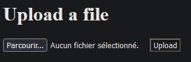

J'ai rapidement fait un fichier avec quelques "aaaa" à l'intérieur, et je l'ai uploadé.
Le résultat était un ficher zip avec :
- myfile.txt.enc, qui contenait le même nombre de caractères que le fichier que j'avais uploadé

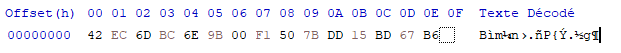
- un fichier flag.txt.enc, contenant 50 caractères qui semblent chiffrés

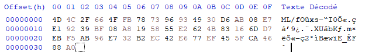
- Un fichier README qui se moque de nous

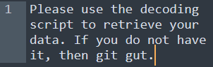

On a donc maintenant une idée de comment le challenge fonctionne.

## Prendre plus d'informations

Commençons par refaire la même chose. Le but ici est de voir si le site est déterministe, si l'output dépend de ce qu'on envoie.
La sortie est la suivante :
- pour notre fichier

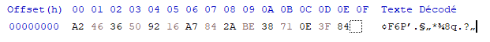
- et le flag

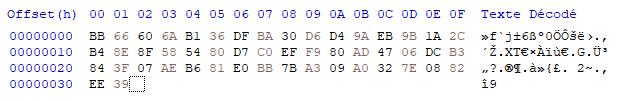

Les outputs sont différents des premiers. Le script n'est donc pas déterministe. Un clé doit être générée pour chaque upload côté serveur.

On va maintenant uploader un fichier plus volumineux, pour voir comment réagi le site avec plus de données.

Avec environ 1500 * `a`
- myfile.txt.enc
  
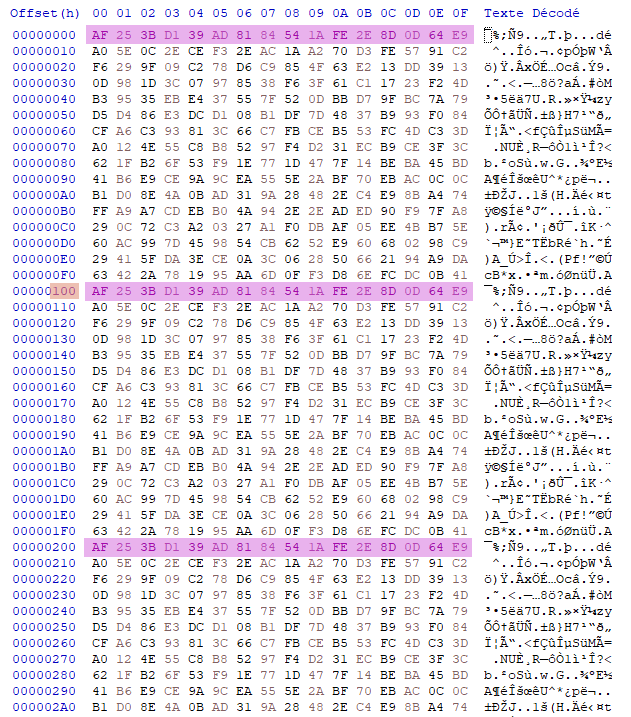

On remarque ici quelque chose d'assez intéressant : des patterns se répètent.
En mesurant plus en détail, on voit que les données en sortie sont les mêmes tous les 256 bytes (offset de `0x100`).


Après cela, on va donc essayer d'envoyer un bloc de 256 `a`, 256 `b` , puis 256 `b`, afin de voir si les blocs ont une influence sur le suivant : 

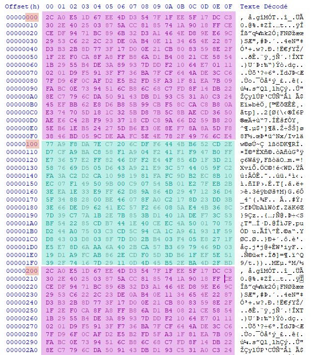

A l'offset `0x000` et `0x200`, on peut voir les deux blocs de `a`, et à l'offset `0x100`, notre bloc de `b`

Après cela, on peut regarder si, au sein d'un bloc, les caractères ont une influence sur ceux du bloc, comme avec la diffusion en AES. (étant donné que ce chiffrement semble être un stream, *(on a vu des tailles de fichiers qui collent exactement au fichier envoyé, donc pas de padding pour compléter un bloc)*, il y a peu de chances qu'il y ait une diffusion, mais vérifions quand même)

On envoie : 128 `a`, 128 `b`, 256 `b`, 256 `a` :

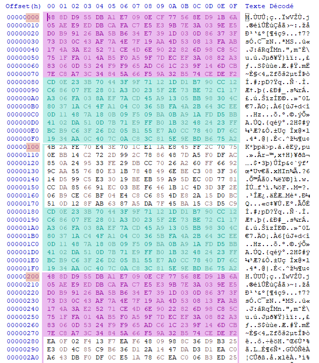

Comme prévu, on reçoit bien nos deux parties de `a` et de `b`. Il n'y a donc pas de diffusion.

On va maintenant tenter une dernière théorie. Si le chiffrement du flag suit la même logique que le chiffrement de notre fichier, cela veut dire qu'un caractère chiffré en commun, à la même position que notre bloc, donne le même caractère. Pour tester cela, on va envoyer `HACKDAY{` suivi du nombre de `a` correct pour compléter le bloc. Si les deux fichiers chiffrés commencent par les mêmes caractères,  cela veut dire qu'on va pouvoir récupérer le flag de la sorte.

On essaie donc. La réponse :

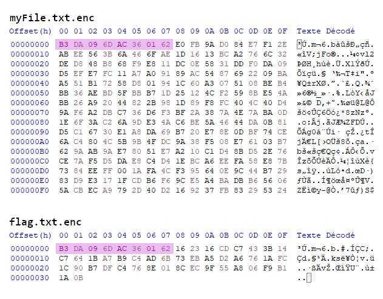

Cela fonctionne.
Pour résumer :
- La méthode de chiffrement chiffre par blocs de 256 caractères.
- Un même caractère à une même position **au sein d'un bloc de 256 bytes** aura la même valeur chiffrée
- Les blocs sont indépendants

Ayant toutes ces infos, on va pouvoir récupérer le flag.

## Le solveur

Avant tout, il va nous falloir une information : la valeur de chaque caractère chiffré à chaque position d'un bloc. On va donc avoir besoin : 
- d'un bloc complet de `a` chiffré
- d'un bloc de `b`
- etc...

Un script python pour fabriquer ce fichier : 
```python
with open("myFile.txt", "w") as f:  
    for i in range(32, 127):  # ici, uniquement les caractères qui sont communéments dans un flag  
        txt = chr(i) * 256  
        f.write(txt)
```

On envoie ce fichier pour le chiffrer, on récupère le zip en question, on l'unzip et on récupère myFile.txt.enc et flag.txt.enc

Le script python pour calculer le flag ressemblera ensuite à ceci :

```python
flagOutput = [" "] * 50  
with open("flag.txt.enc", "rb") as f:  
    encryptedFlag = f.read()  
with open("myFile.txt.enc", "rb") as f:  
    encryptedCharBlocks = f.read()  
for i in range(32, 127):  
    bNum = i - 32  # block number in the file, as we start a char 32  
    block = encryptedCharBlocks[bNum * 256:(bNum + 1) * 256]  
    for j in range(50):  # 50 characters in the flag  
        changed = False  
        if block[j] == encryptedFlag[j]:  
            flagOutput[j] = chr(i)  
            changed = True  
        print("".join(flagOutput)) if changed else None

```


Et ta-da ! 

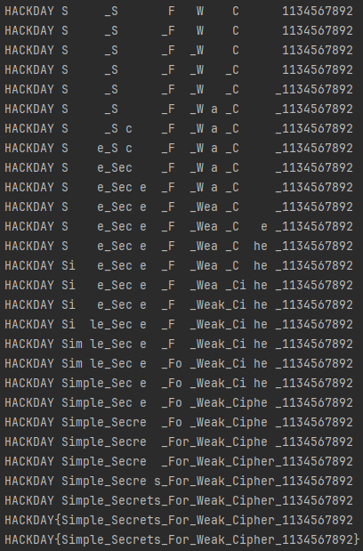

**Flag : HACKDAY{Simple_Secrets_For_Weak_Cipher_1134567892}**

nhy.
