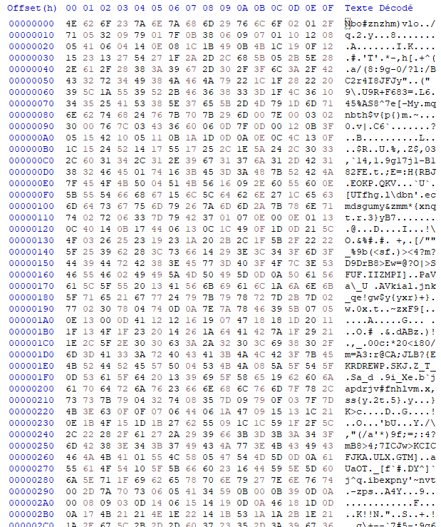
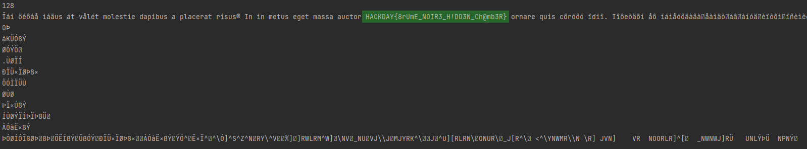

# Well hidden message - Insignificant blue

**Cryptography**

The notes you have discovered hold a secret. They contain a text coded using a process that the monk seems to have devised himself. However, the Black Mist hackers have introduced a subtlety: they have adapted this method to the basic language of machines.

Fichier : secret.txt

---

## Recherches préliminaires

A l'étape précédente, on a trouvé un moine nommé **Johannes Trithemius** *(merci Kazulhu)*. En cherchant des informations a son sujet, on trouve deux méthodes de chiffrement dont il serait l'auteur : 
- [l'Ave Maria de Trithème](https://www.dcode.fr/ave-maria-tritheme)
- [le Chiffre de Trithème](https://www.dcode.fr/chiffre-tritheme)

Après avoir regardé rapidement les deux, le Chiffre de Thritème semble beaucoup plus coller à la consigne, et une adaptation binaire semble plutôt aisée.

## Application

Notre fichier `secret.txt` contient les données suivantes 


On va donc créer un script python pour appliquer le chiffre de Thritème dessus. Seul bémol, on ne connais pas le décalage à utiliser, on va donc tous les tenter jusqu'à trouver le mot HACKDAY dans le clair obtenu.

```python
with open("secret.txt", "rb") as f:  
    secret = f.read()  
  
secretValues = secret  
  
secretValuesBK = secretValues  
for i in range(256):  
    result = "".join([chr(((secretValues[j] - (j + i)) % 256)) for j in range(len(secretValues))])  
    if "HACKDAY" in result:  
        print(i)  
        print(result)  
        print("\n----\n")
```

Après exécution, on obtient ceci :



*Je ne sais à ce jour pas pourquoi le reste du message est corrumpu, cela semblait être du latin tout ce qu'il y a de plus classique. Sûrement un problème de charset.*

**Flag : HACKDAY{8rUmE_NOIR3_H!DD3N_Ch@mb3R}**

nhy.