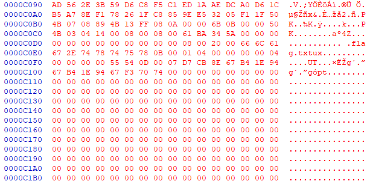
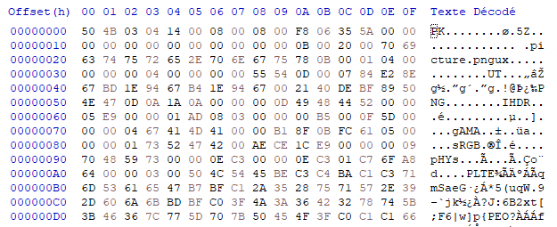
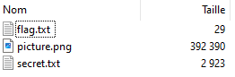
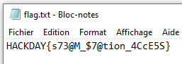

# Well hidden message - Insignificant blue

**Steganography**

On a USB key marked with the seal of the Black Mist, a mysterious film was discovered. This film, that you are watching from the EIGHTH ROW of seats in the Cogswell Halls cinema, shows apparently innocuous scènes. But according to rumors, it is not just a simple video. Data would have been compressed and hidden there…

Fichier : well-hidden-message.avi

---

## Préambule

Le nom du chall mentionne clairement le mot Bleu, Insignificant nous fait penser à du LSB. Enfin, la mention de la HUITIEME LIGNE de siège nous fait penser qu'il faut uniquement observer la huitième ligne des images.

## Rédaction

On va donc rédiger un script permettant d'extraire les LSB sur le canal bleu de chaque frame, uniquement sur la ligne 8

Le script est le suivant :

```python
import cv2  
import numpy as np  
  
  
def extract_lsb_from_8th_line(video_path, hex_output_file):  
    cap = cv2.VideoCapture(video_path)  
    if not cap.isOpened():  
        print("Error: Could not open video.")  
        return  
		  
    lsb_values = []  
		  
    # Iterate through the frames  
    i = 0  
    while True:  
        print(i)  
        i += 1  
        ret, frame = cap.read()
        # Break the loop if no more frames are available  
        if not ret:  
            break 
		line8 = frame[7, :, 0]  # Only 8th line of Blue
		lsb_line8 = line8 & 1
		lsb_values.extend(lsb_line8)
	# save it as hex
	hex_values = []  
	for i in range(0, len(lsb_values), 4):  
		four_bits = lsb_values[i:i + 4]  
		hex_value = int(''.join(map(str, four_bits)), 2)  
		hex_values.append(format(hex_value, 'x'))
	with open(hex_output_file, 'w') as f:  
		f.write(''.join(hex_values))


if __name__ == "__main__":
	video_path = 'well-hidden-message.avi'
	hex_output_file = 'lsb_8th_line_hex.txt'  
	extract_lsb_from_8th_line(video_path, hex_output_file)
```

On obtient un fichier finissant ainsi :


On voit que ce sont des entêtes de fichier zip, donc on est sur la bonne voie, mais il semble manquer des données.

Après maintes et maintes relectures de la consigne, on lit enfin le mot *from*, qu'on interprete ainsi : il faut prendre TOUTES les lignes jusqu'à la 8ème. On modifie donc légèrement le script.

On remplace cette partie 

```python
		line8 = frame[7, :, 0]  # Only 8th line of Blue
		lsb_line8 = line8 & 1
		lsb_values.extend(lsb_line8)
```

par ceci

```python
		for j in range(8):  
	        nth_line = frame[j, :, 0]  
            lsb_nth_line = nth_line & 1  
            lsb_values.extend(lsb_nth_line)
```

Le fichier obtenu ressemble ensuite beaucoup plus à un fichier zip, avec de bon entêtes dès le début du fichier : 



Ceci étant bien plus cohérent, on ouvre le zip avec 7-zip.

On ouvre ensuite le ficher flag.txt


**Flag : HACKDAY{s73@M_$7@tion_4CcE5S}**

nhy & Kazulhu.